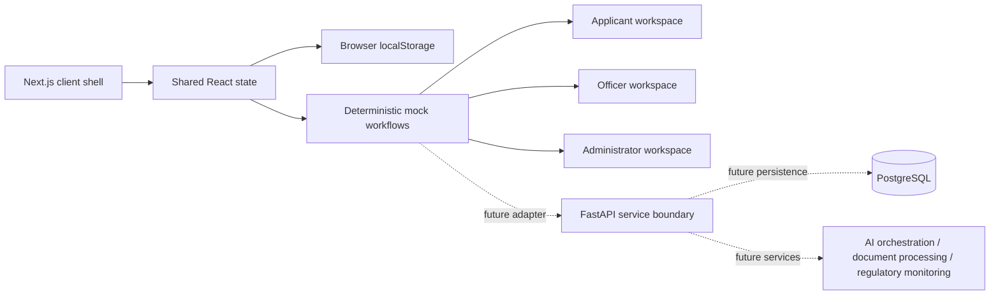

# IndusAI Architecture

## Implemented prototype

IndusAI is a Next.js App Router frontend prototype. The current implementation keeps the demo shell and domain state in `app/page.tsx` so a presenter can move quickly through the complete scenario without a backend. Seed records model projects, approval nodes, applications, documents, notifications, inspections, grievances, incentive schemes, regulatory updates, and audit events.

State is held in React client state and persisted to `localStorage` under `indusai-demo-state`. Actions are deterministic mock workflows: they update the shared record, append timeline/audit events, and create notifications. The role switcher is a clearly labelled presentation switcher, not authentication or production authorization.

## Main boundaries

## Future replacement points

- Replace local state actions with `projectService`, `applicationService`, `documentService`, `inspectionService`, `grievanceService`, `regulatoryService`, `notificationService`, and `analyticsService` API adapters.
- FastAPI would own authorization, validation, workflow orchestration, notifications, and integration adapters.
- PostgreSQL would store users, project profiles, approval definitions, applications, document metadata, timelines, regulatory versions, and audit events.
- AI and OCR would remain service boundaries with explicit source and confidence metadata.
- Government portals, DigiLocker, scraping, email, SMS, and legally binding decisions are intentionally not implemented.

## Domain relationships

Projects own approval roadmaps. Applications reference a project and approval. Documents can satisfy multiple application requirements. Inspections and grievances reference applications. Regulatory updates reference affected approval types and produce notifications. Officer and administrator actions append to the same application, notification, regulatory, and audit state consumed by the applicant view.
