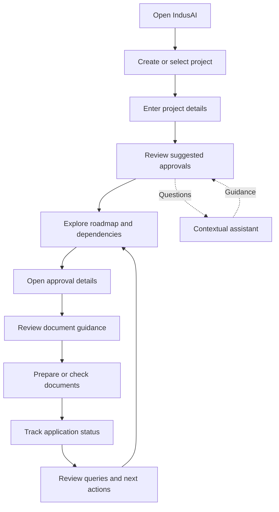
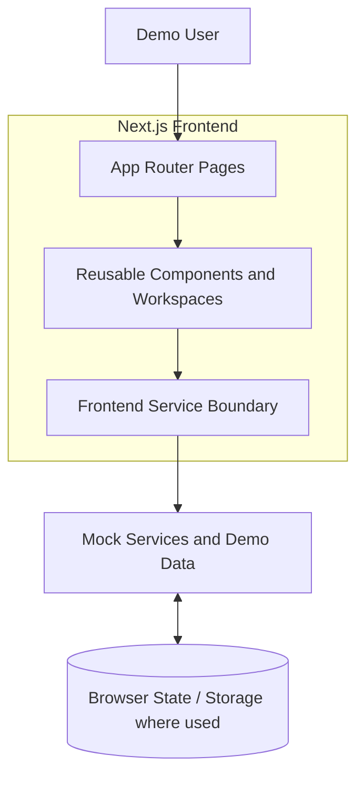
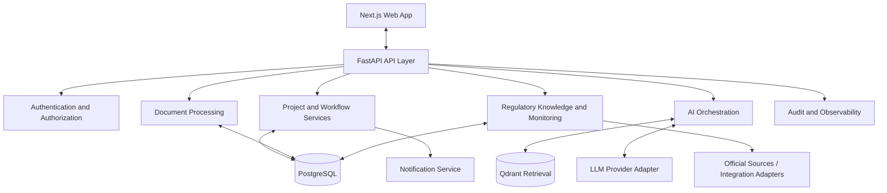
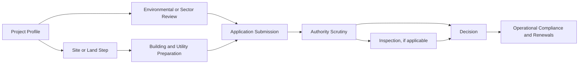

# IndusAI — Industrial Approvals Intelligence

> **Frontend-only interactive prototype for simplifying industrial approvals and compliance workflows.**

IndusAI is designed to help businesses understand and manage registrations, permissions, licences, NOCs, inspections, renewals, and related processes that may apply to an industrial project. It brings project information, approval planning, document preparation, application tracking, and regulatory guidance into one interface.

**Current implementation:** Next.js frontend with mock services and illustrative demo data. No production backend, database, live government integration, or legally verified approval recommendations are included.

## Contents
- [Problem](#problem)
- [Solution](#solution)
- [Core Differentiators](#core-differentiators)
- [Features](#features)
- [Applicant Journey](#applicant-journey)
- [Architecture Diagrams](#architecture-diagrams)
- [Technology Stack](#technology-stack)
- [Project Structure](#project-structure)
- [Getting Started](#getting-started)
- [Demo Behavior](#demo-behavior)
- [Scope and Limitations](#scope-and-limitations)
- [Future Roadmap](#future-roadmap)
- [Responsible Use](#responsible-use)

## Problem

Industrial projects may require approvals from multiple authorities. Requirements and processes can vary according to sector, business activity, location, investment, land and building details, resource use, project stage, and existing permissions.

Applicants often face fragmented information, repeated data entry, unclear dependencies, incomplete submissions, and limited visibility into application progress and next actions.

## Solution

IndusAI is conceived as a unified guidance and coordination layer. Applicants provide project context, review a suggested approval plan, prepare documents, and track progress in one workspace.

The intended flow:
1. Capture project details through a structured profile or guided intake.
2. Discover candidate approvals based on project facts and jurisdiction.
3. Explain why an approval may apply and identify missing information.
4. Build a dependency-aware roadmap with prerequisites and parallel tasks.
5. Provide approval-specific document checklists and preparation guidance.
6. Track applications, queries, target dates, and next actions.
7. Offer contextual assistance and surface potentially relevant regulatory changes.

The prototype demonstrates selected parts of this experience through mock data and simulated behavior.

## Core Differentiators

### Conversational Approval Roadmap Generation
A guided intake gathers project information and shapes a suggested approval plan, moving beyond a generic list toward project-specific guidance.

### Interactive Approval Dependency Graph
Approvals are represented as a visual workflow. The intended graph makes prerequisites, parallel work, blocked steps, and downstream dependencies easier to understand.

### Continuous Regulatory Intelligence
The product concept includes monitoring regulatory information, reviewing changes, and identifying potentially affected projects or roadmap items. The prototype's update entries are illustrative; there is no live monitoring service.

Supporting capabilities include document guidance, a contextual assistant, and unified project/application tracking.

## Features

| Area | Intended capability | Current prototype nature |
|---|---|---|
| Project workspace | Create, view, and manage project records | UI with mock data |
| Project profile | Capture project context for guidance | Depends on fields in current build |
| Dashboard | Summarize projects and application work | Mock summary data |
| Approval roadmap | Visualize candidate approvals and relationships | Interactive UI with illustrative data |
| Applications | Review records, statuses, and timeline information | Simulated tracking |
| Documents | View document-related information and preparation workspace | Prototype UI, not a production vault |
| Assistant | Ask project-oriented questions | Mock/simulated responses |
| Regulatory updates | Review update entries | No live source monitoring |
| Deadlines/notifications | Demonstrate follow-up concepts | No guaranteed delivery or authoritative SLA calculation |

The broader product vision also includes document reuse and validation, inspection coordination, renewals, grievance escalation, incentive discovery, and officer/admin workflows. These should be treated as planned capabilities unless implemented and verified in the current build.

## Applicant Journey



The exact actions available depend on the current demo build.

## Architecture Diagrams

### Current Prototype

The application is intended to run without a backend.



This does **not** imply that FastAPI, PostgreSQL, Qdrant, an external LLM, or government portals are connected.

### Intended Future Production Architecture



This is a target design, not the deployed architecture of the prototype.

### Conceptual Approval Dependencies



This is a generic illustration, not a legally valid sequence for a specific project. Actual requirements and dependencies must be verified for the project's circumstances.

## Technology Stack

### Current prototype
- **Next.js** — application framework and routing
- **React** — component-based UI
- **TypeScript** — typed application code and contracts
- **Tailwind CSS** — styling and responsive layouts
- **Lucide icons** — interface iconography
- **Mock services and client-side state** — simulated behavior and demo data
- **Browser storage, where used** — preserve selected demo state

Check `package.json` for exact versions and scripts.

### Planned production stack

| Layer | Planned technology | Responsibility |
|---|---|---|
| Frontend | Next.js + TypeScript | User interface |
| Backend | FastAPI | APIs and business logic |
| Database | PostgreSQL | Structured application records |
| Vector retrieval | Qdrant | Semantic regulatory retrieval |
| AI orchestration | To be implemented | Intake, retrieval, and assistance |
| Document services | To be implemented | Secure file handling and validation |
| Integrations | To be implemented | External portals and notifications |

These services are not required to run the current prototype.

## Project Structure

Representative structure; consult the repository for exact paths and current files.

```text
frontend/
├── app/
│   ├── page.tsx
│   ├── applications/page.tsx
│   ├── assistant/page.tsx
│   ├── documents/page.tsx
│   ├── projects/
│   │   ├── page.tsx
│   │   ├── new/page.tsx
│   │   └── [id]/page.tsx
│   ├── roadmap/page.tsx
│   ├── regulatory-updates/page.tsx
│   ├── globals.css
│   └── layout.tsx
├── src/
│   ├── components/
│   │   ├── app-shell.tsx
│   │   ├── dashboard.tsx
│   │   ├── roadmap.tsx
│   │   ├── application-workspace.tsx
│   │   ├── documents-workspace.tsx
│   │   └── assistant-workspace.tsx
│   ├── contracts/
│   └── lib/
│       ├── api.ts
│       ├── config.ts
│       └── mock-services.ts
├── package.json
└── ...
```

## Getting Started

### Prerequisites
- Node.js compatible with the installed Next.js version
- npm

### Install and run

```bash
git clone <repository-url>
cd <repository-folder>
cd frontend   # only if frontend is a subdirectory
npm install
npm run dev
```

Open the local URL printed by Next.js, commonly `http://localhost:3000`.

To validate a production build:

```bash
npm run build
```

Use the scripts in `package.json` if they differ from these examples. No API keys or backend services should be needed for the mock-only demo.

## Demo Behavior

- Mock services provide illustrative records and simulate selected actions.
- Some state may persist in browser storage, depending on the feature.
- Assistant responses are not produced by a connected production AI model.
- Approval names, requirements, statuses, and timelines in demo data are examples.
- Clearing browser storage may reset locally persisted progress.
- The prototype does not submit applications to government authorities.

For a presentation, demonstrate a coherent applicant story: open or create a project, inspect its suggested roadmap, open an approval, review document guidance, and use tracking or assistant screens where available.

## Scope and Limitations

### Prototype scope
- Applicant-facing interface
- Project and approval workflow screens
- Interactive navigation and UI components
- Illustrative roadmap and application data
- Mock service layer for selected interactions

### Not production functionality
- FastAPI backend or PostgreSQL persistence
- Live authentication or enforced access control
- Live LLM inference or verified RAG retrieval
- Legally authoritative approval decisions
- Secure document storage, scanning, or real validation
- Government-portal submission
- Live regulatory monitoring
- Guaranteed notifications or authoritative SLA calculations
- Production security, audit, availability, and compliance controls

Present this as a functional product-experience demonstration, not a deployed government approval system.

## Future Roadmap

1. **Backend foundation:** FastAPI APIs, authentication, authorization, PostgreSQL persistence, and validation.
2. **Project intake and applicability:** structured project schema and explainable candidate-approval evaluation.
3. **Regulatory knowledge:** ingest official sources with jurisdiction, effective dates, provenance, review status, and version history.
4. **Roadmap engine:** model dependencies, parallel tasks, decision gates, and legal versus recommended sequencing.
5. **Document workflow:** secure storage, requirement mapping, checks, and validation findings.
6. **Application tracking:** submissions, authority events, queries, due dates, renewals, and escalation history.
7. **Regulatory monitoring:** detect source changes, apply human review, and assess impact on affected projects.
8. **Integrations and operations:** approved external integrations, notifications, observability, backups, and security controls.

## Responsible Use

IndusAI is intended to guide and coordinate; it does not replace competent authorities, official portals, or qualified regulatory advice.

Before real-world use:
- Verify applicability against current official sources and the project's exact jurisdiction and facts.
- Distinguish binding requirements from guidance, service standards, estimates, and recommendations.
- Show sources, effective dates, and review status for regulatory claims.
- Ask for missing facts rather than assuming project characteristics.
- Route uncertain or conflicting requirements for human review.
- Never present illustrative demo data as binding legal requirements.
- Protect business and personal information with appropriate security controls.

**Disclaimer:** This README describes a prototype and product direction. It is not legal advice and does not establish that any particular approval is required, waived, or guaranteed.

## Contributing

1. Keep mock behavior separate from real API integration code.
2. Prefer typed contracts and centralized mock services over duplicated demo data.
3. Clearly distinguish implemented functionality from planned capabilities.
4. Avoid presenting unverified examples as official requirements.
5. Retest the applicant journey after changing shared navigation, project state, roadmap behavior, or application tracking.

---

**Project status:** Frontend-only prototype / hackathon demonstration  
**Primary audience:** Industrial applicants and project proponents  
**Geographic focus:** India, with Maharashtra as an initial focus area  
**Long-term direction:** Evidence-backed, personalized industrial approval and compliance intelligence
