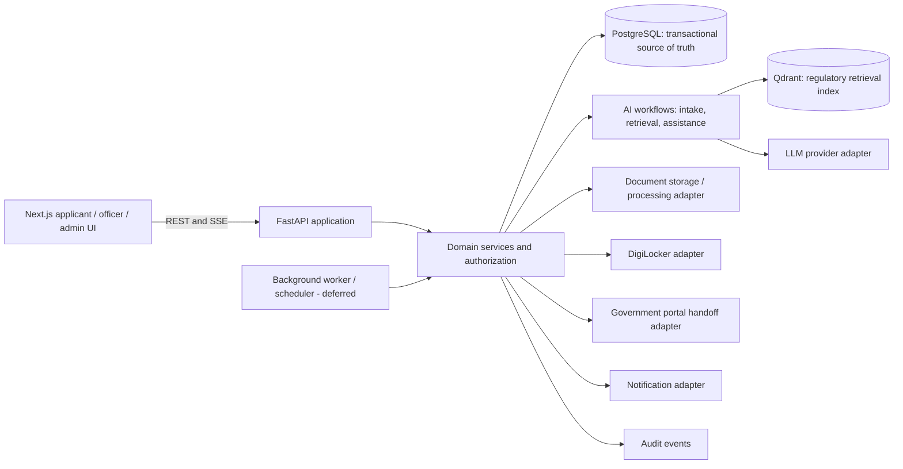

# IndusAI architecture

## System boundaries

The frontend renders state and collects user intent. FastAPI owns authentication, authorization, validation, applicability decisions, dependency evaluation, workflow transitions, and API contracts. PostgreSQL is authoritative for users, projects, roadmap state, documents' metadata, applications, regulatory records, notifications, and audit events. Qdrant is an index for retrieval only; it is not authoritative for structured project or approval state.

Domain services should depend on repository and adapter interfaces, not on specific database, AI provider, cloud storage, or government APIs. API routers translate validated requests and service results to HTTP; they should not contain business rules. Keep provider prompts and orchestration inside backend AI services.

## Core data and roadmap model

- `User` belongs to one or more `Organization` records through explicit membership/role assignments. Roles are applicant, officer, and administrator; permissions are enforced by the backend, not by UI visibility.
- `Project` belongs to an organization and has an editable `ProjectProfile`. Durable profile facts (sector, products, location, investment, site status, and project stage) are stored separately from conversation history.
- `ApprovalDefinition` is reusable regulatory/workflow knowledge. A project-specific `ApprovalTask` snapshots the applicable definition/version and carries rationale, current status, assigned authority, optional deadline/SLA, and required-document references.
- `ApprovalDependency` is a directed edge between tasks in one project roadmap. Multiple incoming edges represent multiple prerequisites; tasks with no dependency path between them may run in parallel. The backend validates references and prevents cycles when generating or editing a roadmap.
- `Document` stores metadata and a storage reference; `DocumentRequirement` maps a task/application requirement to zero or more candidate documents. Binary files are handled by a storage adapter, not stored in PostgreSQL.
- `Application` tracks an applicant's interaction with an authority for an approval. It does not imply official submission or acceptance unless a supported authority integration confirms it.
- `RegulatorySource` and versioned `RegulatoryDocument` records retain source URL, publication/effective dates when known, provenance, review status, and content hash. `RegulatoryUpdate` moves through review before publication and impact assessment.
- `Conversation` and `Message` are distinct from durable project facts. Store concise summaries only when useful; retrieved source passages remain evidence references, not project memory.
- `Notification` and append-only `AuditEvent` record user-visible actions and attributable workflow changes.

Inspections, incentive schemes, and grievance tickets are valid later domain concepts, but are deferred until their core workflows are specified. Avoid creating tables without a concrete workflow and retention/authorization requirements.

### Graph contract

The backend returns a graph envelope with stable string IDs, a project ID, graph version, nodes, and directed edges. Every edge's `source` is a prerequisite and `target` is the dependent task (`depends_on`). Nodes represent approval or other workflow task types and include their status, required documents, rationale, and source references as available. The frontend may derive XYFlow positions and presentation; it must not infer applicability, alter dependency meaning, or recalculate authoritative status.

Statuses initially include `not_started`, `blocked`, `pending`, `in_progress`, `submitted`, `under_review`, `changes_requested`, `completed`, `rejected`, and `cancelled`. A server-side workflow service determines legal transitions and dependency blocking. `estimated_sla_days` and `due_at` are optional; an absent estimate must not be rendered as a legal or official promise. See the mirrored initial schemas in `backend/app/schemas/roadmap.py` and `frontend/src/contracts/roadmap.ts`.

## Core flows

1. **Intake to roadmap:** conversation turns produce candidate profile fields; the applicant confirms or edits them; the backend validates and persists the profile; an approval-discovery service records recommendations, rationale, and source/version references; a roadmap service creates tasks and dependency edges and returns the versioned graph.
2. **Contextual assistant:** authenticate and authorize the project/task; load confirmed profile and current PostgreSQL workflow state; retrieve versioned regulatory evidence from Qdrant and resolve citations to stored sources; generate a bounded answer through the LLM adapter; return answer and evidence references. Unsupported conclusions must be marked unverified and escalated for confirmation.
3. **Document flow:** authorize and accept upload metadata, store bytes through a storage adapter, run extraction/validation asynchronously when available, map extracted facts to document requirements, and retain provenance plus review status. DigiLocker import uses the same document boundary and is simulated by default.
4. **Regulatory update:** monitor/import a source as an unreviewed candidate; an administrator reviews source and proposed interpretation; publication versions the record; impact assessment maps it to definitions and affected projects; notify users only after review.
5. **Officer review:** authorize assignment; record verification, correction request, or decision with actor and audit event; update application/task status through domain transitions; notify the applicant. No action claims an official portal submission or legal decision without confirmed integration evidence.

## Infrastructure conventions

- Use UUID primary keys and explicit foreign keys. Add indexes for common ownership/project/status/date filters and dependency lookups.
- Persist instants as timezone-aware UTC timestamps. Keep source-local dates separate where the regulation defines a date without a time.
- Store statuses as stable string enums. Use JSON only for versioned, bounded provider metadata or flexible source payloads; keep queryable domain relationships normalized.
- Keep transactions within a use case; write the state transition and its audit event atomically. Never make remote network calls inside a database transaction.
- SQLAlchemy models and Alembic migrations will be added with the first persistence-backed workflow. Migration names should describe the schema change; review generated migrations before applying them. Seed illustrative data separately from migration DDL and label it clearly.
- Background processing is a boundary, not yet an implementation. Select a queue/scheduler only when a concrete async workflow needs retries, idempotency, and operational monitoring.

## AI, integrations, security, and operations

- Separate durable profile facts, current project/approval state, conversation history, optional summaries, and retrieved evidence.
- LangGraph belongs in backend workflow modules for intake, discovery assistance, approval chat, document assistance, and regulatory-update analysis. It calls application services and typed provider/retrieval adapters; it cannot bypass authorization or directly mutate domain tables. Detailed graph state and checkpoint persistence are deferred.
- RAG retrieval uses source/version metadata and citation IDs. Qdrant can be rebuilt from reviewed regulatory records.
- DigiLocker defaults to `simulated`; government portal behavior defaults to `handoff_only`. Each adapter reports whether an operation is `real`, `simulated`, `unavailable`, or `unsupported`. No undocumented capabilities or successful external actions are assumed.
- LLM, document storage/extraction, and notification delivery are interfaces with no provider wired in this foundation. Secrets stay backend-side and out of logs and SSE payloads.
- Authentication provider and token/session mechanism remain deployment decisions. All protected routes must validate identity and organization/project scope server-side; role labels supplied by the browser are never authorization.
- Record actor, action, target, timestamp, and relevant before/after state references in an append-only audit trail. Use structured logs with request IDs and redact credentials, tokens, document contents, and hidden model reasoning.

## Decisions and deferred work

Established now: versioned REST prefix `/api/v1`; backend-authoritative domain state; graph direction and shared schema shape; UTC/UUID conventions; source/version provenance; simulated integration defaults; no secrets in frontend.

Deferred: identity provider and login UX, production authorization matrix, database schema/migrations, queue/scheduler, object-storage provider, notification channels, real NSWS/DigiLocker support, LLM provider, RAG ingestion strategy, retention policy, and official regulatory data sources. These require product, operational, or access decisions before implementation.
